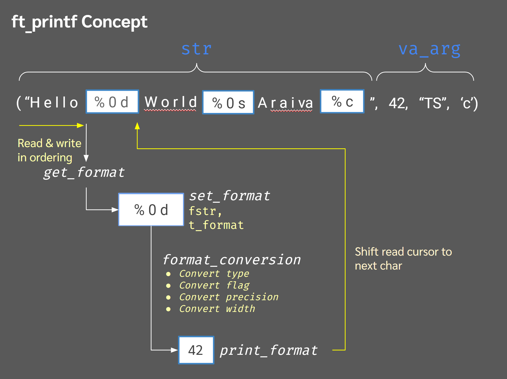

# ft_printf



## Table of Contents

- [Introduction](#introduction)
- [Features](#features)
- [Supported Conversions](#supported-conversions)
- [Installation](#installation)
- [Usage](#usage)
- [Examples](#examples)
- [Project Structure](#project-structure)
- [Contact](#contact)

## Introduction

`ft_printf` is a project from the 42 curriculum that involves recreating the standard C library function `printf`. The goal of this project is to implement a custom `ft_printf` function that mimics the behavior of `printf` while adhering to specific formatting requirements. This project helps in understanding variadic functions, formatting, and handling different data types in C.

## Features

- Custom implementation of the `printf` function: `ft_printf`.
- Support for a variety of format specifiers.
- Robust error handling and input validation.
- Efficient string formatting and output.

## Supported Conversions

`ft_printf` supports the following conversion specifiers:

- `%c`: Prints a single character.
- `%s`: Prints a string of characters.
- `%p`: Prints a pointer address.
- `%d`: Prints a decimal (base 10) number.
- `%i`: Prints an integer in base 10.
- `%u`: Prints an unsigned decimal (base 10) number.
- `%x`: Prints a number in hexadecimal (base 16) lowercase.
- `%X`: Prints a number in hexadecimal (base 16) uppercase.
- `%%`: Prints a percent sign.

## Installation

1. Clone the repository:
   ```sh
   git clone https://github.com/ERROR244/ft_printf.git
   cd ft_printf
   ```

2. Build the library:
   ```sh
   make
   ```

3. You can then link libftprintf.a to your projects:
   ```sh
   gcc -Wall -Wextra -Werror file.c libftprintf.a -o program
   ```

## Usage

To use ft_printf in your project:\

1. Include the header file:
   ```c
   #include "ft_printf.h"
   ```

2. Call ft_printf just like you would with printf:

   ```C
   int main(void)
   {
       ft_printf("Hello, %s!\n", "world");
       ft_printf("The number is %d\n", 42);
       return (0);
   }
   ```
## Examples

   ```c
   #include "ft_printf.h"
   
   int main(void)
   {
       ft_printf("Character: %c\n", 'A');
       ft_printf("String: %s\n", "Hello, world!");
       ft_printf("Pointer: %p\n", &main);
       ft_printf("Integer: %d\n", 12345);
       ft_printf("Unsigned: %u\n", 12345);
       ft_printf("Hex Lowercase: %x\n", 0xabcde);
       ft_printf("Hex Uppercase: %X\n", 0xABCDE);
       ft_printf("Percent Sign: %%\n");
       return 0;
   }
   ```

## Project Structure

```css
ft_printf/
├── ft_printf.c
├── ft_printf.h
├── Makefile
├── print_ch.c
├── print_i_d.c
├── print_p.c
├── print_str.c
├── print_u.c
├── print_x.c
├── README.md
```

## Contact

khalil sohail - [khalilsohail24@gmail.com](mailto:khalilsohail24@gmail.com)

Project Link: [https://github.com/ERROR244/push_swap](https://github.com/ERROR244/push_swap)
